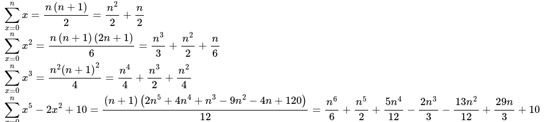

This python3 script, given : 
 - a symbol (such as X) and 
 - a, or many, polynomial(s) expression(s) P (such as X**2+3x),

Outputs :
 - the sum of P(k) formula(s), with k integer from 0 to n.

Technically :
 - [sympy](https://www.sympy.org) is required !
 - the script produces a sum_poly.html file, 
     with [MathJax](https://github.com/mathjax/MathJax) (LaTeX) formatting (web access required)

The maths takes place only here :
```py
def sum_poly(P, X) :
    N, Q = sympy.degree(P)+1, 0
    for i in range(N+1) :
        L = sympy.prod([X-j for j in range(N+1) if j != i])
        s = sum([P.subs(X, k) for k in range(i+1)])
        Q += sympy.Rational((-1)**(N-i), sympy.factorial(i)*sympy.factorial(N-i)) * s * L
    return sympy.factor(Q), sympy.expand(Q)
```

Usage exemple :
```
# Welcome to sum_poly !
# Press enter to continue...
# Choose a symbol (defaut : x) :
x
# Enter a sequence of polynomial expressions (symbol : x, separator : ; ) :
x ; x**2 ; x**3 ; x**5-2*x**2+10           
# SUM for x from 0 to n : 
#   Factor : n*(n + 1)/2
#   Expand : n**2/2 + n/2
# SUM for x**2 from 0 to n : 
#   Factor : n*(n + 1)*(2*n + 1)/6
#   Expand : n**3/3 + n**2/2 + n/6
# SUM for x**3 from 0 to n : 
#   Factor : n**2*(n + 1)**2/4
#   Expand : n**4/4 + n**3/2 + n**2/4
# SUM for x**5 - 2*x**2 + 10 from 0 to n : 
#   Factor : (n + 1)*(2*n**5 + 4*n**4 + n**3 - 9*n**2 - 4*n + 120)/12
#   Expand : n**6/6 + n**5/2 + 5*n**4/12 - 2*n**3/3 - 13*n**2/12 + 29*n/3 + 10
```

MathJax HTML output :



HTML file's source code :
```
<!DOCTYPE html>
  <html>
    <head>
      <meta charset="utf-8"/> <title>sum_poly</title>
      <script src="https://polyfill.io/v3/polyfill.min.js?features=es6"></script>
      <script id="MathJax-script" async src="https://cdn.jsdelivr.net/npm/mathjax@3/es5/tex-mml-chtml.js"></script>
    </head>
    <body>
\(  \displaystyle\sum_{ x=0 }^{ n } x = \frac{n \left(n + 1\right)}{2} = \frac{n^{2}}{2} + \frac{n}{2} \) <br>
\(  \displaystyle\sum_{ x=0 }^{ n } x^{2} = \frac{n \left(n + 1\right) \left(2 n + 1\right)}{6} = \frac{n^{3}}{3} + \frac{n^{2}}{2} + \frac{n}{6} \) <br>
\(  \displaystyle\sum_{ x=0 }^{ n } x^{3} = \frac{n^{2} \left(n + 1\right)^{2}}{4} = \frac{n^{4}}{4} + \frac{n^{3}}{2} + \frac{n^{2}}{4} \) <br>
\(  \displaystyle\sum_{ x=0 }^{ n } x^{5} - 2 x^{2} + 10 = \frac{\left(n + 1\right) \left(2 n^{5} + 4 n^{4} + n^{3} - 9 n^{2} - 4 n + 120\right)}{12} = \frac{n^{6}}{6} + \frac{n^{5}}{2} + \frac{5 n^{4}}{12} - \frac{2 n^{3}}{3} - \frac{13 n^{2}}{12} + \frac{29 n}{3} + 10 \)
<!--insert--here-->
    </body>
  </html>
```

